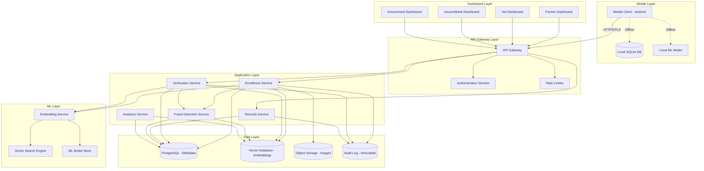

# Design Document: Pashu-Aadhaar AI Platform

## Overview

The Pashu-Aadhaar AI Platform is a mobile-first, AI-powered digital identity system for livestock in rural India. The platform uses deep learning-based computer vision to create unique biometric identities for animals, enabling secure verification, fraud detection, and comprehensive record management across an ecosystem of farmers, veterinarians, insurers, banks, and government agencies.

### Why AI is Essential

**Why Rule-Based Tagging is Insufficient:**
- Physical tags (ear tags, RFID) are easily lost, damaged, or deliberately swapped
- Manual record-keeping is prone to errors and manipulation
- Visual identification by humans is unreliable across large populations
- No cryptographic proof of identity with physical tags

**Why Deep Learning Embeddings are Necessary:**
- Animal biometric features (muzzle patterns, facial structure) are complex and high-dimensional
- Traditional computer vision (edge detection, template matching) cannot capture subtle variations
- Deep learning models learn hierarchical features automatically from data
- Embeddings create a compact, comparable representation in vector space
- Siamese networks and metric learning enable robust similarity comparison
- Models can generalize across breeds, ages, and environmental conditions

**Confidence Threshold Calibration:**
- Enrollment threshold: High confidence (>0.85) to prevent weak identities
- Verification threshold: Context-dependent (insurance: 0.90, routine vet: 0.75)
- Thresholds tuned using ROC curves on validation data
- Regular recalibration based on production false positive/negative rates

**Handling False Positives/Negatives:**
- False Positives (incorrect match): Lower verification threshold, require manual review for high-stakes transactions
- False Negatives (missed match): Provide re-capture guidance, allow multiple verification attempts
- Confidence scores near threshold trigger human-in-the-loop review
- Continuous monitoring and model retraining to reduce error rates

### Design Principles

1. **Mobile-First**: All core functionality accessible via Android mobile client
2. **Offline-Capable**: Enrollment and verification work without connectivity
3. **Low-Bandwidth Optimized**: Minimal data transfer, aggressive compression
4. **Security by Design**: End-to-end encryption, tamper-evident audit logs
5. **Scalable Architecture**: Horizontal scaling for millions of animals
6. **User-Centric**: Simple interfaces for low digital literacy users
7. **API-First**: Enable ecosystem integration via RESTful APIs

## Architecture

### System Components



### Data Flow

**Enrollment Flow:**

1. User captures multi-angle images via Mobile Client
2. Mobile Client validates image quality locally using lightweight model
3. If offline: Store enrollment in local queue with images
4. If online: Send images to Enrollment Service via API Gateway
5. Enrollment Service stores raw images in Object Storage
6. Enrollment Service calls Embedding Service with image references
7. Embedding Service loads images, preprocesses, and generates embedding vector
8. Embedding Service performs duplicate check via Vector Search Engine
9. If unique: Generate Livestock_ID, store embedding in Vector Database
10. Store metadata (owner, location, timestamp) in PostgreSQL
11. Generate QR code and return to Mobile Client
12. Create immutable audit log entry
13. If offline: Sync when connectivity restored, handle conflicts

**Verification Flow:**
1. User captures live image and scans/enters Livestock_ID
2. Mobile Client sends verification request to Verification Service
3. Verification Service retrieves stored embedding from Vector Database
4. Verification Service calls Embedding Service to generate live embedding
5. Embedding Service calculates cosine similarity between embeddings
6. Verification Service applies context-specific threshold
7. If similarity > threshold: Return positive match with confidence score
8. If similarity < threshold: Return negative match, trigger fraud alert
9. Fraud Detection Service analyzes patterns (repeat attempts, anomalies)
10. Create audit log entry with verification result and context
11. Return result to Mobile Client

## Components and Interfaces

### 1. Mobile Client (Android)

**Technology Stack:**
- Kotlin for Android development
- TensorFlow Lite for on-device ML inference
- Room Database for local persistence
- Retrofit for API communication
- CameraX for image capture
- WorkManager for background sync

**Key Interfaces:**

```kotlin
interface EnrollmentInterface {
    suspend fun captureImages(angles: List<CaptureAngle>): List<ImageData>
    suspend fun validateImageQuality(image: ImageData): QualityScore
    suspend fun enrollAnimal(
        images: List<ImageData>,
        ownerInfo: OwnerInfo,
        metadata: AnimalMetadata,
        location: GeoLocation
    ): EnrollmentResult
    suspend fun syncPendingEnrollments(): SyncResult
}

interface VerificationInterface {
    suspend fun captureVerificationImage(): ImageData
    suspend fun verifyAnimal(
        image: ImageData,
        livestockId: String,
        context: VerificationContext
    ): VerificationResult
    suspend fun syncPendingVerifications(): SyncResult
}

interface RecordsInterface {
    suspend fun addVaccinationRecord(
        livestockId: String,
        vaccination: VaccinationData
    ): Result
    suspend fun linkInsurancePolicy(
        livestockId: String,
        policy: PolicyData
    ): Result
    suspend fun getAnimalHistory(livestockId: String): AnimalHistory
}

data class EnrollmentResult(
    val livestockId: String,
    val qrCode: ByteArray,
    val confidenceScore: Double,
    val status: EnrollmentStatus
)

data class VerificationResult(
    val matched: Boolean,
    val confidenceScore: Double,
    val fraudRiskScore: Double,
    val message: String
)
```

**Offline Capabilities:**
- Local SQLite database stores pending operations
- TensorFlow Lite model (~50MB) downloaded on first launch
- Cached embeddings for recently verified animals
- Queue-based sync with conflict resolution
- Exponential backoff for retry logic

### 2. API Gateway

**Technology Stack:**
- Kong or AWS API Gateway
- OAuth 2.0 / JWT for authentication
- Redis for rate limiting and caching

**Key Responsibilities:**
- Request routing to appropriate services
- Authentication and authorization
- Rate limiting (per API key, per IP)
- Request/response logging
- SSL/TLS termination
- API versioning support

**API Endpoints:**

```
POST   /api/v1/enrollment
POST   /api/v1/verification
GET    /api/v1/animals/{livestockId}
POST   /api/v1/animals/{livestockId}/records
GET    /api/v1/animals/{livestockId}/history
POST   /api/v1/fraud/report
GET    /api/v1/analytics/dashboard
GET    /api/v1/audit/logs
```

### 3. Enrollment Service

**Technology Stack:**
- Python with FastAPI
- Celery for async task processing
- Redis for task queue

**Key Responsibilities:**
- Validate enrollment requests
- Coordinate image storage and embedding generation
- Check for duplicate enrollments
- Generate unique Livestock_IDs
- Create audit log entries
- Handle offline sync conflicts

**Interface:**

```python
class EnrollmentService:
    async def enroll_animal(
        self,
        images: List[ImageFile],
        owner_info: OwnerInfo,
        metadata: AnimalMetadata,
        location: GeoLocation,
        timestamp: datetime
    ) -> EnrollmentResponse:
        """
        Enrolls a new animal in the system.
        
        Steps:
        1. Validate input data
        2. Store images in object storage
        3. Generate embedding via Embedding Service
        4. Check for duplicates in Vector Database
        5. If unique, create Livestock_ID and store metadata
        6. Generate QR code
        7. Create audit log entry
        8. Return enrollment result
        """
        pass
    
    async def check_duplicate(
        self,
        embedding: np.ndarray,
        threshold: float = 0.95
    ) -> Optional[str]:
        """
        Checks if embedding matches existing animal.
        Returns Livestock_ID if duplicate found, None otherwise.
        """
        pass
    
    async def handle_sync_conflict(
        self,
        offline_enrollment: EnrollmentData,
        server_state: ServerState
    ) -> ConflictResolution:
        """
        Resolves conflicts when offline enrollment syncs.
        Prioritizes server data, flags conflicts for review.
        """
        pass
```

### 4. Verification Service

**Technology Stack:**
- Python with FastAPI
- Redis for caching recent verifications
- Celery for async processing

**Key Responsibilities:**
- Process verification requests
- Retrieve stored embeddings
- Calculate similarity scores
- Apply context-specific thresholds
- Trigger fraud detection
- Create audit log entries

**Interface:**

```python
class VerificationService:
    async def verify_animal(
        self,
        image: ImageFile,
        claimed_livestock_id: str,
        context: VerificationContext,
        user_id: str
    ) -> VerificationResponse:
        """
        Verifies animal identity against claimed ID.
        
        Steps:
        1. Retrieve stored embedding for claimed_livestock_id
        2. Generate embedding from live image
        3. Calculate cosine similarity
        4. Apply context-specific threshold
        5. Determine match result
        6. Trigger fraud detection if suspicious
        7. Create audit log entry
        8. Return verification result
        """
        pass
    
    def get_threshold_for_context(
        self,
        context: VerificationContext
    ) -> float:
        """
        Returns appropriate similarity threshold based on context.
        
        Thresholds:
        - Insurance claim: 0.90 (high stakes)
        - Loan verification: 0.88
        - Vet visit: 0.75 (routine)
        - Government subsidy: 0.85
        """
        pass
    
    async def calculate_similarity(
        self,
        embedding1: np.ndarray,
        embedding2: np.ndarray
    ) -> float:
        """
        Calculates cosine similarity between two embeddings.
        Returns value between 0 and 1.
        """
        pass
```

### 5. Embedding Service

**Technology Stack:**
- Python with FastAPI
- PyTorch or TensorFlow for model inference
- NVIDIA GPU for acceleration (cloud)
- ONNX Runtime for optimized inference

**Model Architecture:**
- Base: ResNet50 or EfficientNet pretrained on ImageNet
- Fine-tuned on livestock image dataset
- Siamese network architecture for metric learning
- Triplet loss or ArcFace loss for training
- Output: 512-dimensional embedding vector
- L2 normalization for cosine similarity

**Key Responsibilities:**
- Load and preprocess images
- Run inference to generate embeddings
- Handle batch processing for efficiency
- Model versioning and A/B testing
- Performance monitoring

**Interface:**

```python
class EmbeddingService:
    def __init__(self, model_version: str = "v1.0"):
        self.model = self.load_model(model_version)
        self.preprocessor = ImagePreprocessor()
    
    async def generate_embedding(
        self,
        image: ImageFile,
        model_version: Optional[str] = None
    ) -> EmbeddingResponse:
        """
        Generates embedding vector from animal image.
        
        Steps:
        1. Load image from storage or bytes
        2. Preprocess (resize, normalize, augment if needed)
        3. Run model inference
        4. L2 normalize output vector
        5. Return embedding with confidence score
        """
        pass
    
    async def generate_batch_embeddings(
        self,
        images: List[ImageFile]
    ) -> List[EmbeddingResponse]:
        """
        Generates embeddings for multiple images in batch.
        More efficient for multi-angle enrollment.
        """
        pass
    
    def preprocess_image(
        self,
        image: ImageFile
    ) -> torch.Tensor:
        """
        Preprocesses image for model input.
        
        Steps:
        1. Resize to 224x224 (or model input size)
        2. Normalize using ImageNet statistics
        3. Convert to tensor
        4. Add batch dimension
        """
        pass
    
    def validate_image_quality(
        self,
        image: ImageFile
    ) -> QualityScore:
        """
        Validates image quality before processing.
        
        Checks:
        - Resolution (min 640x480)
        - Brightness (not too dark/bright)
        - Blur detection (Laplacian variance)
        - Face/muzzle detection (bounding box confidence)
        """
        pass
```

### 6. Fraud Detection Service

**Technology Stack:**
- Python with FastAPI
- Scikit-learn for anomaly detection
- Redis for pattern tracking

**Key Responsibilities:**
- Detect duplicate enrollment attempts
- Identify suspicious verification patterns
- Calculate fraud risk scores
- Generate alerts for manual review
- Track temporal and geographic anomalies

**Fraud Detection Algorithms:**

**1. Duplicate Enrollment Detection:**
```python
def detect_duplicate_enrollment(
    new_embedding: np.ndarray,
    threshold: float = 0.95
) -> Optional[DuplicateMatch]:
    """
    Searches vector database for similar embeddings.
    If similarity > 0.95, likely duplicate.
    """
    similar = vector_db.search(new_embedding, k=5, threshold=threshold)
    if similar:
        return DuplicateMatch(
            livestock_id=similar[0].id,
            similarity=similar[0].score,
            alert_level="HIGH"
        )
    return None
```

**2. Suspicious Verification Pattern Detection:**
```python
def detect_suspicious_pattern(
    livestock_id: str,
    verification_history: List[VerificationEvent]
) -> FraudAlert:
    """
    Analyzes verification history for suspicious patterns.
    
    Red flags:
    - Multiple failed verifications followed by sudden success
    - Verifications from geographically impossible locations
    - Multiple insurance claims in short timeframe
    - Verification attempts outside normal hours
    """
    risk_score = 0.0
    alerts = []
    
    # Check for failed-then-success pattern
    recent = verification_history[-10:]
    failures = sum(1 for v in recent[:-1] if not v.matched)
    if failures >= 3 and recent[-1].matched:
        risk_score += 0.3
        alerts.append("Multiple failures before success")
    
    # Check geographic impossibility
    locations = [v.location for v in verification_history[-5:]]
    if has_impossible_travel(locations):
        risk_score += 0.4
        alerts.append("Impossible geographic movement")
    
    # Check claim frequency
    claims = [v for v in verification_history if v.context == "insurance_claim"]
    if len(claims) > 2 and days_between(claims[0], claims[-1]) < 90:
        risk_score += 0.5
        alerts.append("Multiple claims in short period")
    
    return FraudAlert(
        livestock_id=livestock_id,
        risk_score=min(risk_score, 1.0),
        alerts=alerts,
        requires_review=risk_score > 0.6
    )
```

**3. Anomaly Detection:**
```python
class AnomalyDetector:
    def __init__(self):
        self.isolation_forest = IsolationForest(contamination=0.1)
        self.trained = False
    
    def train(self, normal_patterns: List[VerificationPattern]):
        """
        Trains anomaly detector on normal verification patterns.
        Features: time_of_day, day_of_week, location, context, frequency
        """
        features = self.extract_features(normal_patterns)
        self.isolation_forest.fit(features)
        self.trained = True
    
    def detect_anomaly(
        self,
        verification: VerificationEvent
    ) -> AnomalyScore:
        """
        Detects if verification event is anomalous.
        Returns score between -1 (anomaly) and 1 (normal).
        """
        features = self.extract_features([verification])
        score = self.isolation_forest.score_samples(features)[0]
        return AnomalyScore(
            score=score,
            is_anomaly=score < -0.5,
            confidence=abs(score)
        )
```

### 7. Vector Search Engine

**Technology Stack:**
- Pinecone, Milvus, or FAISS for vector similarity search
- Approximate Nearest Neighbor (ANN) algorithms
- GPU acceleration for large-scale search

**Key Responsibilities:**
- Store high-dimensional embedding vectors
- Perform fast similarity search
- Support filtering by metadata
- Handle millions of vectors efficiently

**Interface:**

```python
class VectorSearchEngine:
    async def insert_embedding(
        self,
        livestock_id: str,
        embedding: np.ndarray,
        metadata: Dict[str, Any]
    ) -> bool:
        """
        Inserts embedding vector into index.
        Metadata includes: owner_id, location, enrollment_date, breed
        """
        pass
    
    async def search_similar(
        self,
        query_embedding: np.ndarray,
        k: int = 10,
        threshold: float = 0.8,
        filters: Optional[Dict[str, Any]] = None
    ) -> List[SearchResult]:
        """
        Searches for similar embeddings.
        
        Returns top-k results above threshold.
        Supports filtering by metadata (e.g., location, breed).
        Uses cosine similarity metric.
        """
        pass
    
    async def delete_embedding(
        self,
        livestock_id: str
    ) -> bool:
        """
        Removes embedding from index.
        Used when animal is deceased or record is invalidated.
        """
        pass
```

### 8. Records Service

**Technology Stack:**
- Python with FastAPI
- PostgreSQL for relational data

**Key Responsibilities:**
- Manage health records (vaccinations, treatments)
- Link insurance policies and loans
- Store milk yield data
- Provide query interface for animal history
- Version control for record updates

**Data Schema:**

```sql
-- Core animal metadata
CREATE TABLE animals (
    livestock_id VARCHAR(50) PRIMARY KEY,
    owner_id VARCHAR(50) NOT NULL,
    breed VARCHAR(100),
    age_months INTEGER,
    gender VARCHAR(10),
    enrollment_date TIMESTAMP NOT NULL,
    enrollment_location GEOGRAPHY(POINT),
    status VARCHAR(20) DEFAULT 'active',
    created_at TIMESTAMP DEFAULT NOW(),
    updated_at TIMESTAMP DEFAULT NOW()
);

-- Vaccination records
CREATE TABLE vaccinations (
    id SERIAL PRIMARY KEY,
    livestock_id VARCHAR(50) REFERENCES animals(livestock_id),
    vaccine_type VARCHAR(100) NOT NULL,
    administered_by VARCHAR(100),
    administered_date DATE NOT NULL,
    next_due_date DATE,
    batch_number VARCHAR(50),
    location GEOGRAPHY(POINT),
    created_at TIMESTAMP DEFAULT NOW()
);

-- Insurance policies
CREATE TABLE insurance_policies (
    id SERIAL PRIMARY KEY,
    livestock_id VARCHAR(50) REFERENCES animals(livestock_id),
    policy_number VARCHAR(100) UNIQUE NOT NULL,
    provider VARCHAR(100) NOT NULL,
    coverage_amount DECIMAL(10, 2),
    premium_amount DECIMAL(10, 2),
    start_date DATE NOT NULL,
    end_date DATE NOT NULL,
    status VARCHAR(20) DEFAULT 'active',
    created_at TIMESTAMP DEFAULT NOW()
);

-- Loan collateral
CREATE TABLE loan_collateral (
    id SERIAL PRIMARY KEY,
    livestock_id VARCHAR(50) REFERENCES animals(livestock_id),
    loan_id VARCHAR(100) UNIQUE NOT NULL,
    lender VARCHAR(100) NOT NULL,
    loan_amount DECIMAL(10, 2),
    collateral_value DECIMAL(10, 2),
    loan_date DATE NOT NULL,
    status VARCHAR(20) DEFAULT 'active',
    created_at TIMESTAMP DEFAULT NOW()
);

-- Milk yield records
CREATE TABLE milk_yields (
    id SERIAL PRIMARY KEY,
    livestock_id VARCHAR(50) REFERENCES animals(livestock_id),
    yield_date DATE NOT NULL,
    morning_yield DECIMAL(5, 2),
    evening_yield DECIMAL(5, 2),
    total_yield DECIMAL(5, 2),
    recorded_by VARCHAR(100),
    created_at TIMESTAMP DEFAULT NOW()
);
```

### 9. Analytics Service

**Technology Stack:**
- Python with FastAPI
- PostgreSQL for aggregation queries
- Redis for caching dashboard data

**Key Responsibilities:**
- Generate aggregated statistics
- Provide role-based dashboard data
- Track system-wide metrics
- Support geographic and temporal filtering
- Protect individual privacy in aggregates

**Interface:**

```python
class AnalyticsService:
    async def get_farmer_dashboard(
        self,
        farmer_id: str
    ) -> FarmerDashboard:
        """
        Returns dashboard data for a specific farmer.
        Includes: owned animals, health status, upcoming vaccinations
        """
        pass
    
    async def get_vet_dashboard(
        self,
        vet_id: str,
        region: Optional[str] = None
    ) -> VetDashboard:
        """
        Returns dashboard data for veterinarian.
        Includes: animals in region, vaccination coverage, health alerts
        """
        pass
    
    async def get_government_dashboard(
        self,
        admin_id: str,
        filters: DashboardFilters
    ) -> GovernmentDashboard:
        """
        Returns aggregated analytics for government officials.
        Includes: total enrolled animals, geographic distribution,
        vaccination coverage, breed distribution, fraud statistics
        """
        pass
    
    async def get_insurer_dashboard(
        self,
        insurer_id: str
    ) -> InsurerDashboard:
        """
        Returns dashboard for insurance provider.
        Includes: active policies, claim history, fraud risk scores
        """
        pass
```

### 10. Audit Log Service

**Technology Stack:**
- Append-only database (PostgreSQL with triggers or specialized audit DB)
- Cryptographic hashing for tamper-evidence
- Write-once storage for immutability

**Key Responsibilities:**
- Record all system operations
- Ensure tamper-evidence via hashing
- Provide query and export capabilities
- Support compliance audits

**Audit Log Schema:**

```sql
CREATE TABLE audit_log (
    id BIGSERIAL PRIMARY KEY,
    event_id UUID UNIQUE NOT NULL DEFAULT gen_random_uuid(),
    timestamp TIMESTAMP NOT NULL DEFAULT NOW(),
    event_type VARCHAR(50) NOT NULL,
    user_id VARCHAR(50),
    livestock_id VARCHAR(50),
    operation VARCHAR(100) NOT NULL,
    context JSONB,
    ip_address INET,
    user_agent TEXT,
    result VARCHAR(20),
    previous_hash VARCHAR(64),
    current_hash VARCHAR(64) NOT NULL,
    created_at TIMESTAMP DEFAULT NOW()
);

-- Trigger to calculate hash on insert
CREATE OR REPLACE FUNCTION calculate_audit_hash()
RETURNS TRIGGER AS $$
BEGIN
    NEW.previous_hash := (
        SELECT current_hash FROM audit_log
        ORDER BY id DESC LIMIT 1
    );
    NEW.current_hash := encode(
        digest(
            NEW.event_id::text ||
            NEW.timestamp::text ||
            NEW.event_type ||
            COALESCE(NEW.user_id, '') ||
            COALESCE(NEW.livestock_id, '') ||
            NEW.operation ||
            COALESCE(NEW.previous_hash, ''),
            'sha256'
        ),
        'hex'
    );
    RETURN NEW;
END;
$$ LANGUAGE plpgsql;

CREATE TRIGGER audit_hash_trigger
BEFORE INSERT ON audit_log
FOR EACH ROW
EXECUTE FUNCTION calculate_audit_hash();
```

## Data Models

### Core Data Structures

**Livestock Identity:**
```python
@dataclass
class LivestockIdentity:
    livestock_id: str  # Format: PA-{region}-{sequence}-{checksum}
    embedding: np.ndarray  # 512-dimensional vector
    embedding_version: str  # Model version used
    owner_id: str
    breed: Optional[str]
    age_months: Optional[int]
    gender: str
    enrollment_date: datetime
    enrollment_location: GeoPoint
    qr_code: bytes
    status: str  # active, deceased, transferred
    confidence_score: float  # Enrollment confidence
    
    def to_dict(self) -> Dict[str, Any]:
        return {
            "livestock_id": self.livestock_id,
            "owner_id": self.owner_id,
            "breed": self.breed,
            "age_months": self.age_months,
            "gender": self.gender,
            "enrollment_date": self.enrollment_date.isoformat(),
            "location": {
                "lat": self.enrollment_location.latitude,
                "lon": self.enrollment_location.longitude
            },
            "status": self.status,
            "confidence_score": self.confidence_score
        }
```

**Verification Event:**
```python
@dataclass
class VerificationEvent:
    event_id: str
    livestock_id: str
    timestamp: datetime
    location: GeoPoint
    context: VerificationContext  # insurance_claim, vet_visit, loan_verification
    user_id: str
    matched: bool
    confidence_score: float
    fraud_risk_score: float
    image_hash: str  # SHA-256 of verification image
    
    def to_audit_entry(self) -> AuditEntry:
        return AuditEntry(
            event_type="verification",
            livestock_id=self.livestock_id,
            operation=f"verify_{self.context.value}",
            context={
                "matched": self.matched,
                "confidence": self.confidence_score,
                "fraud_risk": self.fraud_risk_score,
                "location": {
                    "lat": self.location.latitude,
                    "lon": self.location.longitude
                }
            },
            user_id=self.user_id,
            result="success" if self.matched else "failed"
        )
```

**Health Record:**
```python
@dataclass
class HealthRecord:
    record_id: str
    livestock_id: str
    record_type: str  # vaccination, treatment, checkup
    date: datetime
    administered_by: str
    details: Dict[str, Any]
    location: GeoPoint
    created_at: datetime
    version: int  # For record versioning
    
@dataclass
class VaccinationRecord(HealthRecord):
    vaccine_type: str
    batch_number: str
    next_due_date: Optional[datetime]
```

**Fraud Alert:**
```python
@dataclass
class FraudAlert:
    alert_id: str
    livestock_id: str
    alert_type: str  # duplicate_enrollment, suspicious_pattern, anomaly
    risk_score: float  # 0.0 to 1.0
    details: List[str]
    requires_review: bool
    status: str  # pending, reviewed, resolved, false_positive
    created_at: datetime
    reviewed_at: Optional[datetime]
    reviewed_by: Optional[str]
    resolution: Optional[str]
```

## Correctness Properties

*A property is a characteristic or behavior that should hold true across all valid executions of a system—essentially, a formal statement about what the system should do. Properties serve as the bridge between human-readable specifications and machine-verifiable correctness guarantees.*

Before defining the correctness properties, let me analyze the acceptance criteria for testability:


### Property 1: Embedding Generation Consistency
*For any* valid animal image (meeting quality thresholds), the Embedding_Model SHALL generate a 512-dimensional embedding vector with all values in valid range and a confidence score between 0 and 1.
**Validates: Requirements 1.1, 1.3, 2.2**

### Property 2: Image Quality Validation
*For any* image with quality issues (low resolution, poor lighting, excessive blur, or missing biometric features), the System SHALL reject the image and provide specific feedback about the quality issue.
**Validates: Requirements 1.2, 6.3, 11.3**

### Property 3: Unique Livestock ID Generation
*For any* successful enrollment that exceeds the confidence threshold, the System SHALL generate a unique Livestock_ID that has never been assigned before and follows the format PA-{region}-{sequence}-{checksum}.
**Validates: Requirements 1.4**

### Property 4: QR Code Round-Trip
*For any* generated Livestock_ID, encoding it into a QR code and then decoding the QR code SHALL produce the identical Livestock_ID.
**Validates: Requirements 1.5**

### Property 5: Enrollment Metadata Completeness
*For any* enrollment, the stored record SHALL contain non-null geo-location coordinates, timestamp, and owner_id, and if optional metadata (breed, age, vaccination) is provided, it SHALL be retrievable by querying with the Livestock_ID.
**Validates: Requirements 1.6, 1.7**

### Property 6: Offline Operation Sync
*For any* operation (enrollment, verification, record creation) performed in offline mode, the operation SHALL be queued locally, persisted across app restarts, and automatically synced when connectivity is restored, with sync conflicts resolved by prioritizing server data and flagging conflicts for review.
**Validates: Requirements 1.8, 2.7, 3.5, 7.2, 7.3, 7.7, 7.10**

### Property 7: Duplicate Enrollment Detection
*For any* pair of embeddings with cosine similarity exceeding 0.95, the System SHALL detect them as duplicates, alert the user, and prevent duplicate registration.
**Validates: Requirements 1.9, 5.1**

### Property 8: Audit Log Immutability
*For any* system operation (enrollment, verification, record update, fraud alert), the System SHALL create an immutable audit log entry containing timestamp, user_id, operation type, context, and a cryptographic hash linking to the previous entry, and the entry SHALL NOT be modifiable after creation.
**Validates: Requirements 1.10, 2.6, 5.7, 8.7, 9.1, 9.2, 9.3**

### Property 9: Embedding Retrieval
*For any* valid Livestock_ID that has been enrolled, the System SHALL be able to retrieve the stored embedding vector from the Vector Database.
**Validates: Requirements 2.1**

### Property 10: Similarity Score Validity
*For any* pair of embedding vectors, the calculated cosine similarity score SHALL be a value between 0 and 1 inclusive.
**Validates: Requirements 2.3**

### Property 11: Verification Threshold Logic
*For any* verification where the similarity score exceeds the context-specific threshold, the System SHALL return a positive match result, and for any verification where the similarity score falls below the threshold, the System SHALL return a negative match result and generate a fraud risk alert.
**Validates: Requirements 2.4, 2.5**

### Property 12: Verification Performance
*For any* verification request, the System SHALL return results within 10 seconds of image capture for 95% of requests.
**Validates: Requirements 2.8, 8.2**

### Property 13: Suspicious Verification Pattern Detection
*For any* sequence of verification attempts for the same Livestock_ID where 3 or more verifications fail within a 24-hour period followed by a successful verification, the System SHALL flag the pattern for fraud review and increase the fraud risk score.
**Validates: Requirements 2.9, 2.10, 5.3**

### Property 14: Record Linkage Completeness
*For any* record (vaccination, insurance policy, loan collateral, milk yield) linked to a Livestock_ID, querying the animal's history SHALL return that record along with all other linked records.
**Validates: Requirements 3.1, 3.2, 3.3, 3.4, 3.6**

### Property 15: Record Versioning
*For any* modification to an existing record, the System SHALL create a new version in the Audit_Log while preserving the original entry, allowing retrieval of both old and new versions.
**Validates: Requirements 3.7**

### Property 16: Vaccination Type Validation
*For any* vaccination record with a vaccine type not in the predefined approved list, the System SHALL reject the record, and for any vaccination record with an approved vaccine type, the System SHALL accept and store it.
**Validates: Requirements 3.8**

### Property 17: Dashboard Data Completeness
*For any* farmer with enrolled animals, the farmer dashboard SHALL display all animals owned by that farmer, and for any animal with health records, the veterinarian view SHALL display all vaccination records, health logs, and treatment history.
**Validates: Requirements 4.1, 4.2**

### Property 18: Dashboard Field Presence
*For any* animal profile accessed by an insurer or banker, the response SHALL contain verified identity status, fraud risk score, and linked policies or loans fields.
**Validates: Requirements 4.3**

### Property 19: Aggregated Analytics Accuracy
*For any* set of enrolled animals in the database, the government dashboard aggregated counts (total enrolled, geographic distribution, vaccination coverage) SHALL match the actual data when queried directly.
**Validates: Requirements 4.4**

### Property 20: Role-Based Access Control
*For any* user attempting to access data, the System SHALL enforce role-based permissions, denying access to unauthorized data and allowing access only to data within the user's role scope.
**Validates: Requirements 4.5, 8.6**

### Property 21: Dashboard Filter Correctness
*For any* filter criteria (date range, location, status) applied to dashboard data, all returned records SHALL match the filter criteria.
**Validates: Requirements 4.7**

### Property 22: Privacy Protection in Aggregates
*For any* aggregated analytics view, the displayed data SHALL NOT contain individual farmer identifiable information (names, phone numbers, exact addresses).
**Validates: Requirements 4.8**

### Property 23: Multiple Claims Fraud Detection
*For any* Livestock_ID with more than 2 insurance claims filed within a 90-day period, the System SHALL generate a fraud alert with elevated risk score.
**Validates: Requirements 5.2**

### Property 24: Multiple ID Matching Detection
*For any* embedding that matches (similarity > 0.90) multiple different Livestock_IDs, the System SHALL flag all associated IDs for investigation.
**Validates: Requirements 5.4**

### Property 25: High Fraud Risk Notification
*For any* animal with a fraud risk score exceeding 0.8, the System SHALL notify relevant stakeholders and require manual review before processing high-stakes transactions.
**Validates: Requirements 5.5**

### Property 26: Geographic Anomaly Detection
*For any* sequence of verification events for the same Livestock_ID where consecutive events are separated by more than 500km within less than 24 hours, the System SHALL log the anomaly and alert administrators.
**Validates: Requirements 5.6**

### Property 27: Fraud Investigation Data Completeness
*For any* fraud alert, querying the investigation interface SHALL return all verification attempts, enrollment history, and associated records for that Livestock_ID.
**Validates: Requirements 5.8**

### Property 28: Model Accuracy Threshold
*For any* validation dataset of at least 1000 animal images with ground truth labels, the Embedding_Model SHALL achieve at least 90% identity match accuracy.
**Validates: Requirements 6.1**

### Property 29: Context-Specific Thresholds
*For any* verification context (insurance claim, vet visit, loan verification), the System SHALL apply a different similarity threshold, with insurance claims having the highest threshold (0.90) and routine vet visits having lower threshold (0.75).
**Validates: Requirements 6.2**

### Property 30: Low Confidence Flagging
*For any* verification where the confidence score is within 0.05 of the threshold (either above or below), the System SHALL flag the verification for manual review.
**Validates: Requirements 6.5**

### Property 31: Edge Case Handling
*For any* image classified as an edge case (young animal, injured animal, poor lighting), the Embedding_Model SHALL either maintain accuracy above 85% or explicitly flag the result with low confidence (< 0.7).
**Validates: Requirements 6.8**

### Property 32: Data Compression
*For any* data transmission between Mobile_Client and Backend_API, the transmitted data size SHALL be at least 30% smaller than the uncompressed size.
**Validates: Requirements 7.6**

### Property 33: Local Data Encryption
*For any* sensitive data (embeddings, personal information, Livestock_IDs) stored locally on the Mobile_Client, the data SHALL be encrypted using AES-256 or equivalent, and SHALL NOT be readable in plaintext from the file system.
**Validates: Requirements 7.8, 9.5**

### Property 34: Mobile Performance
*For any* operation (enrollment, verification, record creation) on the Mobile_Client, the operation SHALL complete within 15 seconds on devices meeting minimum specifications.
**Validates: Requirements 7.9**

### Property 35: API Authentication
*For any* API request without valid authentication credentials (API key or OAuth token), the System SHALL return a 401 Unauthorized response, and for any request with valid credentials, the System SHALL process the request.
**Validates: Requirements 8.1**

### Property 36: Required Field Validation
*For any* enrollment API request missing required fields (images, owner_id, location), the System SHALL return a 400 Bad Request error with details of missing fields, and for any request with all required fields, the System SHALL return a generated Livestock_ID.
**Validates: Requirements 8.3**

### Property 37: Rate Limiting
*For any* API client making more than 100 requests per minute, the System SHALL reject subsequent requests with a 429 Too Many Requests response until the rate limit window resets.
**Validates: Requirements 8.4**

### Property 38: Standardized Error Responses
*For any* error condition in the Backend_API, the response SHALL contain a standardized JSON structure with error_code, message, and details fields.
**Validates: Requirements 8.5**

### Property 39: Webhook Delivery
*For any* fraud event or verification result when webhooks are configured for the relevant stakeholder, the System SHALL send an HTTP POST notification to the configured webhook URL within 5 seconds of the event.
**Validates: Requirements 8.10**

### Property 40: Audit Log Query Filtering
*For any* audit log query with filter criteria (date range, user_id, operation type, Livestock_ID), all returned audit entries SHALL match all specified filter criteria.
**Validates: Requirements 9.4**

### Property 41: TLS Encryption
*For any* data transmission between Mobile_Client and Backend_API, the connection SHALL use TLS 1.2 or higher, and SHALL NOT transmit data over unencrypted HTTP.
**Validates: Requirements 9.6**

### Property 42: Password Policy Enforcement
*For any* password that does not meet minimum requirements (8 characters, uppercase, lowercase, number, special character), the System SHALL reject it, and for any password meeting requirements, the System SHALL accept it.
**Validates: Requirements 9.7**

### Property 43: Audit Trail Integrity After Archival
*For any* record that has been archived according to data retention policies, the complete audit trail for that record SHALL remain accessible and unmodified.
**Validates: Requirements 9.8**

### Property 44: Security Incident Alerting
*For any* detected security incident (5+ failed login attempts, data tampering attempt, unauthorized API access), the System SHALL generate an alert to administrators within 1 minute.
**Validates: Requirements 9.9**

### Property 45: Audit Export Format Validity
*For any* audit log export request, the exported file SHALL be in valid JSON or CSV format and SHALL be parseable by standard tools.
**Validates: Requirements 9.10**

### Property 46: Enrollment Performance
*For any* set of 100 enrollment requests, at least 95 SHALL complete within 30 seconds.
**Validates: Requirements 10.2**

### Property 47: Horizontal Scaling Consistency
*For any* two Backend_API instances handling the same type of request, the average response time SHALL not differ by more than 20%.
**Validates: Requirements 10.3**

### Property 48: Query Performance at Scale
*For any* database query on a table with 10 million+ records, the query SHALL complete within 2 seconds when using properly indexed fields.
**Validates: Requirements 10.4**

### Property 49: Graceful Degradation
*For any* high load scenario (>80% CPU or memory utilization), the System SHALL continue processing core verification and enrollment requests while potentially delaying non-critical features like analytics generation.
**Validates: Requirements 10.5**

### Property 50: Backup Performance Isolation
*For any* automated backup operation, user-facing API response times SHALL not increase by more than 10% during the backup window.
**Validates: Requirements 10.8**

### Property 51: Concurrent Connection Support
*For any* load test with 10,000 simultaneous mobile client connections, the System SHALL maintain at least 95% success rate for verification requests.
**Validates: Requirements 10.10**

### Property 52: Multi-Language Support
*For any* supported regional language (Hindi, Tamil, Telugu, Bengali, Marathi), the Mobile_Client SHALL display all UI text and audio instructions in that language when selected.
**Validates: Requirements 11.4, 11.10**

### Property 53: Operation Result Messages
*For any* completed operation (enrollment, verification, record creation), the System SHALL provide a success or error message to the user.
**Validates: Requirements 11.5**

### Property 54: Training Data Anonymization
*For any* enrollment data stored for model training purposes, the data SHALL have all personally identifiable information (owner name, phone, address) removed or pseudonymized.
**Validates: Requirements 12.1**

### Property 55: Ground Truth Capture
*For any* verification result that is manually reviewed and corrected, the System SHALL store the ground truth label (correct match/no match) linked to the verification event for future model training.
**Validates: Requirements 12.2**

### Property 56: Model Performance Metrics
*For any* model evaluation run, the System SHALL calculate and store accuracy, precision, recall, false positive rate, and false negative rate metrics.
**Validates: Requirements 12.5**

### Property 57: Embedding Backward Compatibility
*For any* new Embedding_Model version, when comparing embeddings generated by the new model with embeddings generated by the previous model for the same animal, the similarity score SHALL be at least 0.80.
**Validates: Requirements 12.7**

### Property 58: Systematic Error Detection
*For any* breed or condition where the false negative rate exceeds 20% over a 30-day period, the System SHALL generate an alert to ML engineers.
**Validates: Requirements 12.9**

### Property 59: Model Versioning and Rollback
*For any* deployed model version, the System SHALL store the model version identifier with each generated embedding, and SHALL maintain the capability to load and use any of the previous 3 model versions.
**Validates: Requirements 12.10**


## Error Handling

### Error Categories and Handling Strategies

**1. Image Quality Errors**
- **Cause**: Poor lighting, blur, wrong angle, low resolution
- **Detection**: Preprocessing validation before embedding generation
- **Response**: Return specific error code with guidance (e.g., "IMAGE_TOO_DARK: Move to better lighting")
- **User Action**: Re-capture image with guidance
- **Retry**: Immediate retry allowed

**2. Network Errors**
- **Cause**: No connectivity, timeout, server unavailable
- **Detection**: HTTP request failure, timeout exception
- **Response**: Queue operation locally, show offline mode indicator
- **User Action**: Continue working offline
- **Retry**: Automatic retry with exponential backoff when connectivity restored

**3. Duplicate Detection Errors**
- **Cause**: Attempting to enroll an already-enrolled animal
- **Detection**: High similarity (>0.95) with existing embedding
- **Response**: Return DUPLICATE_ANIMAL error with existing Livestock_ID
- **User Action**: Verify if truly duplicate or contact support
- **Retry**: Not allowed without manual review

**4. Verification Mismatch Errors**
- **Cause**: Live image doesn't match claimed Livestock_ID
- **Detection**: Similarity score below threshold
- **Response**: Return VERIFICATION_FAILED with confidence score and fraud alert
- **User Action**: Re-capture image or escalate to manual review
- **Retry**: Limited to 3 attempts per hour to prevent fraud

**5. Authentication Errors**
- **Cause**: Invalid API key, expired token, insufficient permissions
- **Detection**: Authentication middleware validation
- **Response**: Return 401 Unauthorized or 403 Forbidden with clear message
- **User Action**: Re-authenticate or contact administrator
- **Retry**: After obtaining valid credentials

**6. Validation Errors**
- **Cause**: Missing required fields, invalid data format
- **Detection**: Request validation before processing
- **Response**: Return 400 Bad Request with detailed field-level errors
- **User Action**: Correct input and resubmit
- **Retry**: Immediate retry after correction

**7. Rate Limit Errors**
- **Cause**: Too many requests from same client
- **Detection**: Rate limiter middleware
- **Response**: Return 429 Too Many Requests with Retry-After header
- **User Action**: Wait for rate limit window to reset
- **Retry**: Automatic retry after specified delay

**8. Model Inference Errors**
- **Cause**: Model loading failure, GPU out of memory, corrupted model file
- **Detection**: Exception during model inference
- **Response**: Return 503 Service Unavailable, alert administrators
- **User Action**: Retry after brief delay
- **Retry**: Automatic retry up to 3 times, then fail gracefully

**9. Database Errors**
- **Cause**: Connection failure, query timeout, constraint violation
- **Detection**: Database exception handling
- **Response**: Return 500 Internal Server Error (generic to user), log detailed error
- **User Action**: Retry operation
- **Retry**: Automatic retry with exponential backoff

**10. Fraud Detection Errors**
- **Cause**: High fraud risk score, suspicious patterns
- **Detection**: Fraud detection algorithms
- **Response**: Return FRAUD_ALERT with risk score, require manual review
- **User Action**: Contact administrator for review
- **Retry**: Not allowed until manual review completed

### Error Response Format

All API errors follow a standardized JSON format:

```json
{
  "error": {
    "code": "ERROR_CODE",
    "message": "Human-readable error message",
    "details": {
      "field": "specific_field_name",
      "reason": "Detailed explanation",
      "suggestion": "Recommended action"
    },
    "timestamp": "2024-01-15T10:30:00Z",
    "request_id": "req_abc123xyz"
  }
}
```

### Circuit Breaker Pattern

For external service calls (object storage, vector database):
- Track failure rate over sliding window (1 minute)
- If failure rate > 50%, open circuit for 30 seconds
- During open circuit, fail fast without attempting call
- After 30 seconds, allow single test request (half-open)
- If test succeeds, close circuit; if fails, remain open

### Graceful Degradation

When non-critical services fail:
- **Analytics Service Down**: Return cached dashboard data, show staleness indicator
- **Fraud Detection Service Down**: Allow operations with warning, queue for later fraud analysis
- **Audit Log Service Down**: Queue audit entries locally, sync when service recovers
- **Vector Search Slow**: Increase timeout, reduce search depth, return partial results

### Logging and Monitoring

**Error Logging Levels:**
- **ERROR**: Unexpected failures requiring investigation (model errors, database failures)
- **WARN**: Recoverable issues (rate limits, validation failures, verification mismatches)
- **INFO**: Normal operations (successful enrollments, verifications)
- **DEBUG**: Detailed diagnostic information (embedding values, similarity scores)

**Monitoring Alerts:**
- Error rate > 5% for any endpoint → Alert on-call engineer
- Verification latency > 15 seconds → Alert performance team
- Fraud alert rate spike (>3x baseline) → Alert security team
- Model inference failures → Alert ML team immediately

## Testing Strategy

### Dual Testing Approach

The Pashu-Aadhaar platform requires both unit testing and property-based testing for comprehensive coverage:

**Unit Tests**: Verify specific examples, edge cases, and error conditions
- Specific enrollment scenarios (valid data, missing fields, invalid formats)
- Specific verification scenarios (exact match, near match, no match)
- Edge cases (empty images, corrupted data, boundary values)
- Integration points between components
- Error handling paths

**Property-Based Tests**: Verify universal properties across all inputs
- Generate random valid enrollments and verify properties hold
- Generate random verification attempts and verify threshold logic
- Test fraud detection with randomized patterns
- Validate data integrity properties across random operations
- Ensure performance properties hold across varied loads

Both approaches are complementary and necessary. Unit tests catch concrete bugs in specific scenarios, while property-based tests verify general correctness across the input space.

### Property-Based Testing Configuration

**Framework Selection:**
- **Python Services**: Use Hypothesis library
- **Kotlin Mobile Client**: Use Kotest property testing
- **TypeScript (if used)**: Use fast-check library

**Test Configuration:**
- Minimum 100 iterations per property test (due to randomization)
- Increase to 1000 iterations for critical properties (enrollment, verification)
- Use deterministic random seed for reproducibility
- Tag each test with feature name and property number

**Test Tagging Format:**
```python
@given(st.valid_animal_images(), st.owner_info(), st.geo_locations())
@settings(max_examples=100)
def test_property_1_embedding_generation_consistency(images, owner, location):
    """
    Feature: pashu-aadhaar-platform, Property 1: Embedding Generation Consistency
    
    For any valid animal image (meeting quality thresholds), the Embedding_Model
    SHALL generate a 512-dimensional embedding vector with all values in valid
    range and a confidence score between 0 and 1.
    """
    result = embedding_service.generate_embedding(images[0])
    
    assert result.embedding.shape == (512,)
    assert np.all(np.isfinite(result.embedding))
    assert 0.0 <= result.confidence_score <= 1.0
```

### Test Coverage Requirements

**Unit Test Coverage:**
- Minimum 80% code coverage for all services
- 100% coverage for critical paths (enrollment, verification, fraud detection)
- All error handling paths must have explicit tests
- All API endpoints must have integration tests

**Property Test Coverage:**
- Each correctness property (1-59) must have at least one property-based test
- Critical properties (enrollment, verification, fraud) must have multiple property tests
- Performance properties must have load tests validating statistical thresholds

### Test Data Generation

**Generators for Property Tests:**

```python
# Hypothesis strategies for generating test data

@st.composite
def valid_animal_images(draw):
    """Generate valid animal images meeting quality thresholds."""
    width = draw(st.integers(min_value=640, max_value=4096))
    height = draw(st.integers(min_value=480, max_value=4096))
    brightness = draw(st.floats(min_value=0.3, max_value=0.8))
    blur_score = draw(st.floats(min_value=100, max_value=1000))
    
    return ImageData(
        width=width,
        height=height,
        brightness=brightness,
        blur_score=blur_score,
        has_muzzle=True
    )

@st.composite
def livestock_ids(draw):
    """Generate valid Livestock_IDs."""
    region = draw(st.sampled_from(['MH', 'UP', 'RJ', 'GJ', 'PB']))
    sequence = draw(st.integers(min_value=1, max_value=999999))
    checksum = calculate_checksum(region, sequence)
    return f"PA-{region}-{sequence:06d}-{checksum}"

@st.composite
def embeddings(draw):
    """Generate valid embedding vectors."""
    vector = draw(st.lists(
        st.floats(min_value=-1.0, max_value=1.0, allow_nan=False),
        min_size=512,
        max_size=512
    ))
    # L2 normalize
    norm = np.linalg.norm(vector)
    return np.array(vector) / norm if norm > 0 else np.array(vector)

@st.composite
def verification_contexts(draw):
    """Generate verification contexts."""
    return draw(st.sampled_from([
        VerificationContext.INSURANCE_CLAIM,
        VerificationContext.VET_VISIT,
        VerificationContext.LOAN_VERIFICATION,
        VerificationContext.GOVERNMENT_SUBSIDY
    ]))
```

### Integration Testing

**Test Environments:**
- **Local**: Docker Compose with all services for developer testing
- **Staging**: Cloud environment mirroring production for pre-release testing
- **Production**: Canary deployments with gradual rollout

**Integration Test Scenarios:**
- End-to-end enrollment flow (mobile → API → database → vector DB)
- End-to-end verification flow with fraud detection
- Offline sync scenarios with conflict resolution
- Multi-stakeholder dashboard access with RBAC
- Webhook delivery for fraud alerts
- Audit log integrity across service failures

### Performance Testing

**Load Testing:**
- Simulate 10,000 concurrent mobile clients
- Sustained load: 100 enrollments/second, 500 verifications/second
- Peak load: 500 enrollments/second, 2000 verifications/second
- Measure: response time percentiles (p50, p95, p99), error rate, throughput

**Stress Testing:**
- Gradually increase load until system breaks
- Identify bottlenecks and failure modes
- Verify graceful degradation under extreme load

**Endurance Testing:**
- Run sustained load for 24 hours
- Monitor for memory leaks, connection pool exhaustion
- Verify system stability over time

### Security Testing

**Penetration Testing:**
- API authentication bypass attempts
- SQL injection, XSS, CSRF attacks
- Rate limit bypass attempts
- Unauthorized data access attempts

**Vulnerability Scanning:**
- Automated scanning of dependencies for known vulnerabilities
- Regular updates of security patches
- Container image scanning for vulnerabilities

**Audit Log Integrity Testing:**
- Attempt to modify audit log entries
- Verify hash chain integrity
- Test tamper detection mechanisms

### Model Testing

**Accuracy Testing:**
- Validate on holdout test set (minimum 1000 animals)
- Measure accuracy, precision, recall, F1 score
- Analyze confusion matrix for systematic errors
- Test across different breeds, ages, lighting conditions

**Robustness Testing:**
- Test with adversarial examples (slightly modified images)
- Test with edge cases (young animals, injured animals, poor lighting)
- Measure confidence calibration (predicted confidence vs actual accuracy)

**Fairness Testing:**
- Ensure model performs equally across different breeds
- Verify no systematic bias against specific animal types
- Test performance across different geographic regions

### Continuous Integration

**CI Pipeline:**
1. Code commit triggers automated build
2. Run unit tests (must pass 100%)
3. Run property-based tests (must pass 100%)
4. Run integration tests (must pass 95%+)
5. Run security scans (no high/critical vulnerabilities)
6. Generate coverage report (must meet thresholds)
7. Build Docker images
8. Deploy to staging environment
9. Run smoke tests on staging
10. If all pass, mark build as deployable

**Test Execution Time:**
- Unit tests: < 5 minutes
- Property tests: < 15 minutes
- Integration tests: < 30 minutes
- Total CI pipeline: < 60 minutes

## Deployment Architecture

### Infrastructure

**Cloud Provider**: AWS (or equivalent)

**Core Services:**
- **Compute**: ECS/EKS for containerized services, auto-scaling groups
- **Database**: RDS PostgreSQL (Multi-AZ for high availability)
- **Vector Database**: Pinecone (managed) or self-hosted Milvus on EC2
- **Object Storage**: S3 for images and model files
- **Cache**: ElastiCache Redis for rate limiting and caching
- **CDN**: CloudFront for mobile app distribution and static assets
- **Load Balancer**: Application Load Balancer with SSL termination
- **Monitoring**: CloudWatch, Prometheus, Grafana
- **Logging**: ELK Stack (Elasticsearch, Logstash, Kibana)

### Scalability Strategy

**Horizontal Scaling:**
- API services: Auto-scale based on CPU (target 70%) and request rate
- Embedding service: GPU instances, scale based on queue depth
- Database: Read replicas for analytics queries
- Vector database: Sharding by region for geographic distribution

**Vertical Scaling:**
- GPU instances for embedding service (T4, V100, or A100 based on load)
- Database instance size based on storage and IOPS requirements

**Caching Strategy:**
- Recent verification results: 5-minute TTL
- Dashboard data: 15-minute TTL
- Model files: CDN caching with long TTL
- Embedding lookups: Redis cache with LRU eviction

### Disaster Recovery

**Backup Strategy:**
- Database: Automated daily backups, 30-day retention, point-in-time recovery
- Object storage: Cross-region replication for images
- Vector database: Daily snapshots to S3
- Audit logs: Write to S3 in addition to database (immutable storage)

**Recovery Time Objective (RTO)**: 15 minutes
**Recovery Point Objective (RPO)**: 1 hour

**Disaster Recovery Plan:**
1. Detect failure via monitoring alerts
2. Assess impact and determine recovery strategy
3. Failover to standby region if necessary
4. Restore from latest backup
5. Verify data integrity
6. Resume operations
7. Post-mortem and prevention measures

### Security Architecture

**Network Security:**
- VPC with private subnets for databases and internal services
- Public subnets only for load balancers
- Security groups restricting traffic to necessary ports
- WAF (Web Application Firewall) for API protection

**Data Security:**
- Encryption at rest: AES-256 for all stored data
- Encryption in transit: TLS 1.2+ for all communications
- Key management: AWS KMS or equivalent
- Secrets management: AWS Secrets Manager or HashiCorp Vault

**Access Control:**
- IAM roles with least privilege principle
- Multi-factor authentication for administrative access
- API keys with rotation policy (90 days)
- OAuth 2.0 for third-party integrations

**Compliance:**
- GDPR compliance for personal data handling
- Data residency requirements (India data stays in India)
- Regular security audits and penetration testing
- Incident response plan and breach notification procedures

## Future Enhancements

### Phase 2 Features

1. **IoT Collar Integration**: Real-time location tracking and health monitoring
2. **Milk Yield Prediction**: ML model predicting yield based on health and nutrition
3. **Disease Outbreak Detection**: Geographic clustering of health issues
4. **Blockchain Integration**: Immutable supply chain traceability
5. **Payment Integration**: Direct subsidy disbursement and insurance payouts
6. **Marketplace**: Connect farmers with buyers based on verified livestock
7. **Breeding Recommendations**: AI-powered breeding program optimization
8. **Nutrition Optimization**: Feed recommendations based on yield goals

### Scalability Roadmap

- **Year 1**: 1 million animals, 100K farmers, 5 states
- **Year 2**: 10 million animals, 1M farmers, 15 states
- **Year 3**: 50 million animals, 5M farmers, pan-India

### Model Improvements

- **Multi-modal Learning**: Combine muzzle, face, horn, and body patterns
- **Temporal Tracking**: Track animal growth and changes over time
- **Few-shot Learning**: Identify rare breeds with limited training data
- **Active Learning**: Prioritize labeling of uncertain predictions
- **Federated Learning**: Train models across distributed data without centralization
